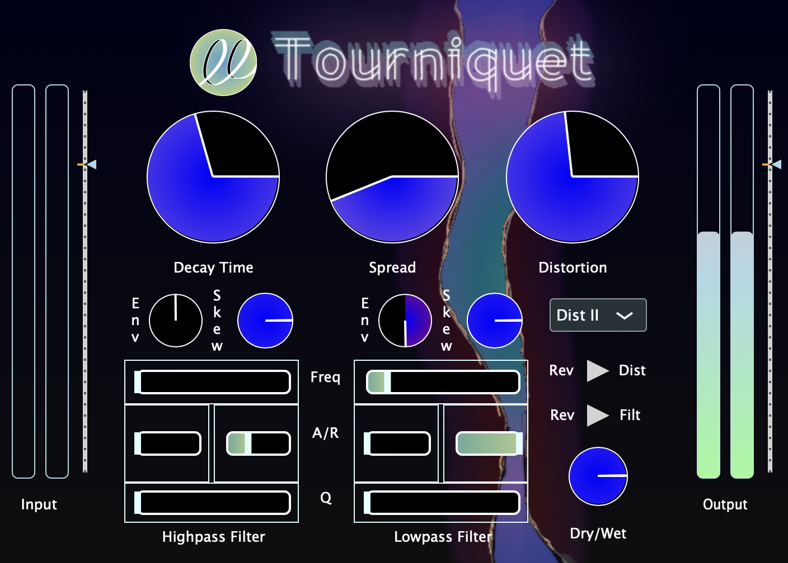

# Tourniquet

## Features
- Schroeder reverb with adjustable delay lines
- 12dB Filter sections with skew control and envelope triggered by midi 
- Distortion with 3 selectable waveshapers and oversampling

## Description
Tourniquet is an audio plugin I developed with JUCE over the past month and is a fine representation of the Mozey River sound palette. Its signal chain includes a reverb, wave shaper, and filter. The routing order is flexible via the UI. The reverb uses the classic Schroeder reverb algorithm, and is controlled by adjusting all pass and comb filter delay lines. The waveshaper includes 3 different distortion types, which are selectable by a combo box. Lastly, the filter section includes a high pass and low pass filter, each with an envelope triggered by incoming midi. The skew of the filters is adjustable in the UI. The slider includes a neat visual representation of the envelope status, which was the hardest part of the plugin to code.  

The user interface was fun to build! I used a combination of a custom look and feel class and images created in Photoshop. AI helped me implement my ideas and worked as a great learning tool. I enjoyed picking colors for each component, and how each choice fit into the larger plugin canvas. The layout is intuitive and each section is distinguished.

I look forward to exploring the use cases for this plugin during music production sessions. I found Tourniquet works best on simple oscillators, which allows the wave shaper to create pleasing harmonics. The adjustable filter skew factor increases control of the filter envelope. The switchable distortion type gives 3 options to shape the incoming sound timbre. The reverb was tuned for control of decay time and spread. Decay time is adjusted by scaling the delay line times. Spread also scales the delay lines but at the rate of separate prime numbers to limit the buildup of harmonic feedback.

This project was the first plugin I took to completion, and allowed me to solidify my knowledge of JUCE and C++. I am now comfortable efficiently handling plugin parameter management, UI design, and audio block processing. I am excited to tackle larger DSP algorithms, and explore their use in not only JUCE, but also embedded systems!
